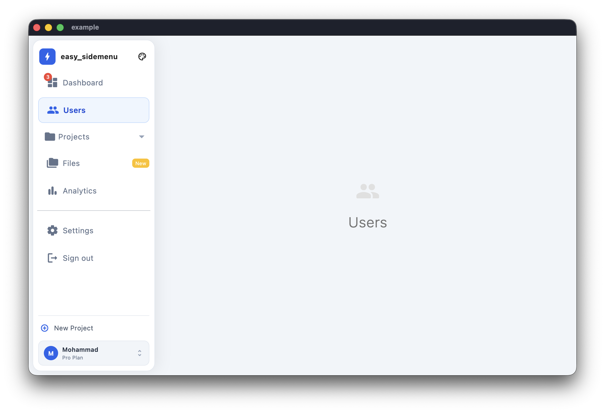
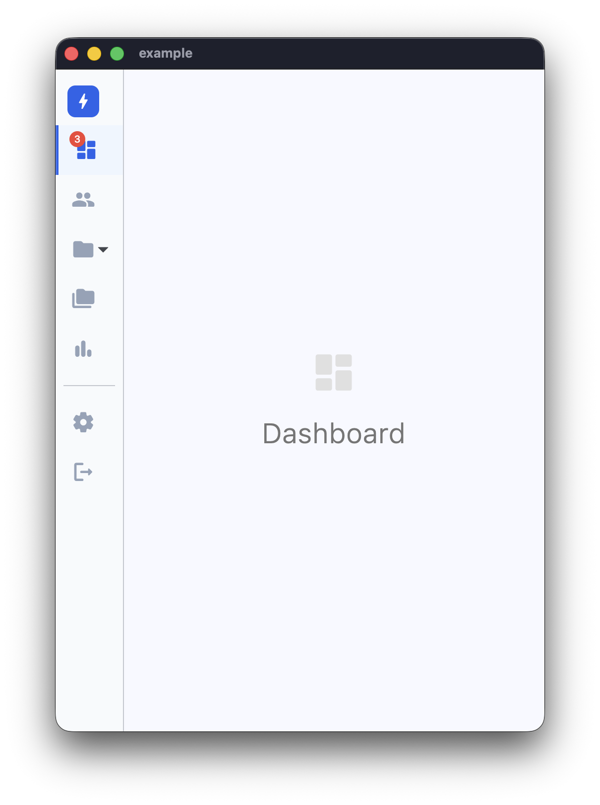
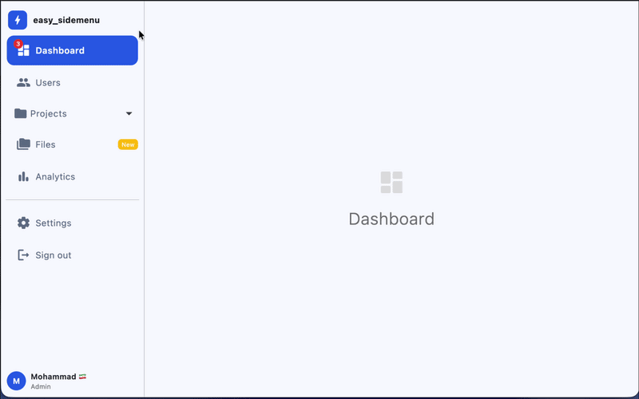

<div align="center">
<h1>Easy Sidemenu</h1>

<br/><br/>

<a href="https://github.com/Jamalianpour/easy_sidemenu/blob/master/LICENSE">
  
</a>
<a href="https://pub.dev/packages/easy_sidemenu">
  
</a>
<a href="https://github.com/Jamalianpour/easy_sidemenu">
  
</a>

</div>

A highly customisable side navigation menu for Flutter. Supports Material 3 theming, glassmorphism, floating card panels, expansion items, badges, and responsive auto-collapse — with zero external dependencies.

---

## Screenshots

| Open | Compact |
|------|---------|
|  |  |

| Auto |
|------|
|  |

## Live demo

[https://jamalianpour.github.io/easy_sidemenu](https://jamalianpour.github.io/easy_sidemenu)

---

## Getting started

Add the dependency:

```yaml
dependencies:
  easy_sidemenu: ^1.0.0
```

```dart
import 'package:easy_sidemenu/easy_sidemenu.dart';
```

---

## Basic usage

```dart
import 'package:easy_sidemenu/easy_sidemenu.dart';
import 'package:flutter/material.dart';

class MyHomePage extends StatefulWidget {
  const MyHomePage({super.key});

  @override
  State<MyHomePage> createState() => _MyHomePageState();
}

class _MyHomePageState extends State<MyHomePage> {
  final _controller = SideMenuController();
  final _pageController = PageController();

  @override
  void initState() {
    super.initState();
    // Mirror selections to a PageView (or any router)
    _controller.addListener(() {
      _pageController.jumpToPage(_controller.currentIndex);
    });
  }

  @override
  void dispose() {
    _controller.dispose();
    _pageController.dispose();
    super.dispose();
  }

  @override
  Widget build(BuildContext context) {
    return Scaffold(
      body: Row(
        children: [
          SideMenu(
            controller: _controller,
            items: [
              SideMenuItem(
                title: 'Dashboard',
                icon: const Icon(Icons.dashboard_rounded),
                onTap: (index, controller) => controller.goTo(index),
              ),
              SideMenuItem(
                title: 'Settings',
                icon: const Icon(Icons.settings_rounded),
                onTap: (index, controller) => controller.goTo(index),
              ),
            ],
          ),
          Expanded(
            child: PageView(
              controller: _pageController,
              physics: const NeverScrollableScrollPhysics(),
              children: const [
                Center(child: Text('Dashboard')),
                Center(child: Text('Settings')),
              ],
            ),
          ),
        ],
      ),
    );
  }
}
```

---

## Items

### `SideMenuItem`

```dart
SideMenuItem(
  title: 'Dashboard',
  icon: const Icon(Icons.dashboard_rounded),
  // Optional badge overlaid on the icon
  badge: const Text('3', style: TextStyle(color: Colors.white, fontSize: 10)),
  // Tooltip shown in compact mode
  tooltipContent: 'Dashboard',
  // Widget shown at the trailing edge in open mode
  trailing: const Icon(Icons.chevron_right, size: 16),
  onTap: (index, controller) => controller.goTo(index),
),
```

#### Custom builder

Replace the default layout entirely for a single item:

```dart
SideMenuItem(
  builder: (context, displayMode) {
    return const Divider(height: 24, indent: 8, endIndent: 8);
  },
),
```

### `SideMenuExpansionItem`

```dart
SideMenuExpansionItem(
  title: 'Projects',
  icon: const Icon(Icons.folder_rounded),
  initiallyExpanded: false,
  children: [
    SideMenuItem(
      title: 'Active',
      icon: const Icon(Icons.circle, size: 10),
      onTap: (index, controller) => controller.goTo(index),
    ),
    SideMenuItem(
      title: 'Archived',
      icon: const Icon(Icons.circle_outlined, size: 10),
      onTap: (index, controller) => controller.goTo(index),
    ),
  ],
),
```

---

## Controller

`SideMenuController` extends `ChangeNotifier`:

```dart
final controller = SideMenuController(initialIndex: 0);

// Navigate to an item
controller.goTo(2);

// Read the current index
print(controller.currentIndex);

// Listen for changes
controller.addListener(() {
  print('Selected: ${controller.currentIndex}');
});

// Always dispose
controller.dispose();
```

---

## Theming

`SideMenuThemeData` is a Material 3 `ThemeExtension`. Register it once for the whole app, or pass it directly to a single `SideMenu`.

### App-wide (recommended)

```dart
MaterialApp(
  theme: ThemeData(
    colorScheme: ColorScheme.fromSeed(seedColor: Colors.blue),
    useMaterial3: true,
    extensions: const [
      SideMenuThemeData(
        openWidth: 260,
        selectedColor: Color(0xFF2563EB),
        selectedIconColor: Colors.white,
        selectedTitleStyle: TextStyle(color: Colors.white, fontWeight: FontWeight.w600),
      ),
    ],
  ),
)
```

### Per-widget override

```dart
SideMenu(
  controller: controller,
  theme: const SideMenuThemeData(
    displayMode: SideMenuDisplayMode.compact,
    compactWidth: 72,
  ),
  items: [...],
)
```

### `SideMenuThemeData` properties

| Property | Type | Default | Description |
|---|---|---|---|
| `displayMode` | `SideMenuDisplayMode` | `auto` | `auto` / `open` / `compact` |
| `openWidth` | `double` | `300` | Width in open mode |
| `compactWidth` | `double` | `70` | Width in compact mode |
| `collapseWidth` | `double` | `600` | Screen width at which `auto` switches to compact |
| `menuDecoration` | `BoxDecoration?` | `null` | Full decoration for the menu container (overrides `backgroundColor`) |
| `backdropSigma` | `double?` | `null` | Blur sigma for glassmorphism — wraps the menu in `BackdropFilter` |
| `backgroundColor` | `Color?` | `ColorScheme.surface` | Menu background (ignored when `menuDecoration` is set) |
| `selectedItemDecoration` | `BoxDecoration?` | `null` | Full decoration for the selected item (overrides `selectedColor`) |
| `selectedColor` | `Color?` | `ColorScheme.primaryContainer` | Selected item highlight |
| `hoverColor` | `Color?` | `onSurface 8%` | Hover highlight |
| `selectedHoverColor` | `Color?` | `primaryContainer 80%` | Hover colour when item is also selected |
| `selectedIconColor` | `Color?` | `ColorScheme.onPrimaryContainer` | Icon colour when selected |
| `unselectedIconColor` | `Color?` | `ColorScheme.onSurfaceVariant` | Icon colour when unselected |
| `iconSize` | `double` | `24` | Icon size |
| `selectedTitleStyle` | `TextStyle?` | `labelLarge / onPrimaryContainer` | Title text style when selected |
| `unselectedTitleStyle` | `TextStyle?` | `labelLarge / onSurfaceVariant` | Title text style when unselected |
| `itemHeight` | `double` | `50` | Item row height |
| `itemBorderRadius` | `BorderRadius` | `circular(8)` | Item corner radius |
| `itemOuterPadding` | `EdgeInsetsGeometry` | `symmetric(h: 5)` | Padding around each item |
| `itemInnerSpacing` | `double` | `8` | Spacing between icon and title |
| `showTooltip` | `bool` | `true` | Show item title as tooltip in compact mode |
| `showHamburger` | `bool` | `false` | Show a hamburger button that collapses the menu |
| `toggleColor` | `Color?` | `onSurfaceVariant` | Expand/collapse toggle icon colour |
| `expansionArrowColor` | `Color?` | `onSurfaceVariant` | Expansion arrow in collapsed state |
| `expansionArrowOpenColor` | `Color?` | `ColorScheme.primary` | Expansion arrow in open state |

### `SideMenu` properties

| Property | Type | Default | Description |
|---|---|---|---|
| `controller` | `SideMenuController` | required | Manages the selected index |
| `items` | `List<SideMenuItemBase>` | required | Items to display |
| `theme` | `SideMenuThemeData?` | `null` | Per-widget theme override |
| `title` | `Widget?` | `null` | Widget shown above items |
| `footer` | `Widget?` | `null` | Widget pinned to the bottom |
| `alwaysShowFooter` | `bool` | `false` | Keep footer visible in compact mode |
| `showToggle` | `bool` | `false` | Show collapse/expand toggle button |
| `collapseWidth` | `double` | `600` | Screen width threshold for auto mode |
| `displayModeToggleDuration` | `Duration` | `350 ms` | Open ↔ compact animation duration |
| `onDisplayModeChanged` | `ValueChanged<SideMenuDisplayMode>?` | `null` | Called when display mode changes |

---

## Advanced customisation

### Gradient sidebar

```dart
SideMenu(
  controller: controller,
  theme: const SideMenuThemeData(
    menuDecoration: BoxDecoration(
      gradient: LinearGradient(
        colors: [Color(0xFF667EEA), Color(0xFF764BA2)],
        begin: Alignment.topCenter,
        end: Alignment.bottomCenter,
      ),
    ),
    selectedColor: Color(0x33FFFFFF),
    selectedIconColor: Colors.white,
  ),
  items: [...],
)
```

### Left-border selected indicator (Minimal style)

```dart
SideMenu(
  controller: controller,
  theme: const SideMenuThemeData(
    selectedItemDecoration: BoxDecoration(
      color: Color(0xFFEFF6FF),
      border: Border(left: BorderSide(color: Color(0xFF2563EB), width: 3)),
    ),
    itemBorderRadius: BorderRadius.zero,
    itemOuterPadding: EdgeInsets.zero,
  ),
  items: [...],
)
```

### Glassmorphism

Requires a `backdropSigma` and a semi-transparent `menuDecoration`. Place the `SideMenu` inside a widget that has a visible background (image, gradient) behind it.

```dart
// 1. Wrap the whole layout in a gradient container
Container(
  decoration: const BoxDecoration(
    gradient: LinearGradient(
      colors: [Color(0xFF1A1A2E), Color(0xFF0F3460)],
    ),
  ),
  child: Row(
    children: [
      // 2. The SideMenu renders as a frosted panel
      SideMenu(
        controller: controller,
        theme: SideMenuThemeData(
          backdropSigma: 18,
          menuDecoration: BoxDecoration(
            color: Colors.white.withValues(alpha: 0.15),
            border: Border(
              right: BorderSide(color: Colors.white.withValues(alpha: 0.25)),
            ),
          ),
          selectedIconColor: Colors.white,
          unselectedIconColor: Colors.white70,
        ),
        items: [...],
      ),
      Expanded(child: ...),
    ],
  ),
)
```

### Floating card (rounded + shadow)

Wrap the `SideMenu` in a `Padding` and set `menuDecoration` with a `borderRadius` and `boxShadow`:

```dart
Row(
  children: [
    Padding(
      padding: const EdgeInsets.all(8),
      child: SideMenu(
        controller: controller,
        theme: SideMenuThemeData(
          menuDecoration: BoxDecoration(
            color: Colors.white,
            borderRadius: const BorderRadius.all(Radius.circular(16)),
            border: Border.all(color: const Color(0xFFE2E8F0)),
            boxShadow: [
              BoxShadow(
                color: Colors.black.withValues(alpha: 0.08),
                blurRadius: 24,
                offset: const Offset(4, 0),
              ),
            ],
          ),
        ),
        items: [...],
      ),
    ),
    Expanded(child: ...),
  ],
)
```

---

## Migrating from v0.7

See [MIGRATION.md](MIGRATION.md) for a complete before/after guide covering every breaking change.

Quick summary:

| v0.7 | v1.0 |
|---|---|
| `SideMenuStyle(...)` | `SideMenuThemeData(...)` |
| `style:` param on `SideMenu` | `theme:` param on `SideMenu` |
| `openSideMenuWidth` | `openWidth` |
| `compactSideMenuWidth` | `compactWidth` |
| `controller.changePage(i)` | `controller.goTo(i)` |
| `controller.currentPage` | `controller.currentIndex` |
| `controller.addListener((i) {...})` | `controller.addListener(() { use controller.currentIndex })` |
| `SideMenuItemType` | `SideMenuItemBase` |
| `badgeContent:` | `badge:` |
| `initialExpanded:` | `initiallyExpanded:` |

---

## Contributing

Issues and pull requests are welcome on [GitHub](https://github.com/Jamalianpour/easy_sidemenu).

---

## License

MIT — see [LICENSE](https://github.com/Jamalianpour/easy_sidemenu/blob/master/LICENSE) for details.
